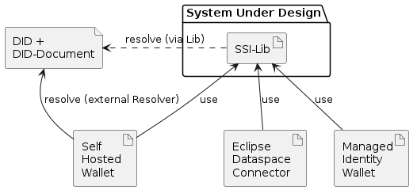

# Architecture

**Documentation Template: arc42**

arc42, the template for documentation of software and system architecture.
Template Version 8.2 EN. (based upon AsciiDoc version), January 2023
See [arc42.org](https://arc42.org/license).

## Introduction and Goals

The *SSI Agent Lib* (hereafter referred to as the **lib**) is an open-source Java library developed under the Tractus-X project. It provides core functionalities and abstractions commonly required when implementing a digital wallet or any service leveraging self-sovereign identities (SSI).

### Requirements Overview

The lib supports the following use cases and interactions:

| Feature                                                                         | Description / Constraints |
| ------------------------------------------------------------------------------- | ------------------------- |
| [Create DID](Feature-Create-Did.md)                                             |                           |
| [Parse DID](Feature-Parse-Did.md)                                               |                           |
| [Generate DID document](Feature-Generate-Did-Document.md)                       |                           |
| [Resolve DID document](Feature-Resolve-Did-Document.md)                         |                           |
| [Issue Verifiable Credential](Feature-Issue-Verifiable-Credential.md)           |                           |
| [Issue Verifiable Presentation](Feature-Issue-Verifiable-Presentation.md)       |                           |
| [Verify Verifiable Presentation](Feature-Verify-Verifiable-Presentation.md)     |                           |
| [Validate Verifiable Presentation](Feature-Validate-Verifiable-Presentation.md) |                           |
| [Generate a key pair](Feature-Generate-Key-Pair.md)                             | Only Ed25519 supported.   |

### Quality Goals

| Priority | Quality Goal  | Scenario                                                                            |
|----------|-------------- |-------------------------------------------------------------------------------------|
| 1        | Flexibility   | Support for multiple cryptographic algorithms.                             |
| 1        | Extensibility | Integration of custom implementations for certain aspects (e.g., DID resolution). |
| 2        | Usability     | Seamless integration and usage within other systems.                         |

## Architecture Constraints

- Java is the designated programming language to ensure compatibility with the Managed Identity Wallet and the [Tractus-X EDC](https://github.com/eclipse-tractusx/tractusx-edc).
- [JWT](https://www.w3.org/TR/vc-data-model/#json-web-token) based verifiable presentations are required for interoperability with the [DAPS](https://github.com/International-Data-Spaces-Association/IDS-G/tree/main/Components/IdentityProvider/DAPS), which uses JWT Access-Tokens for AuthN/AuthZ.
- [JsonWebKey2020](https://www.w3.org/community/reports/credentials/CG-FINAL-lds-jws2020-20220721/) serves as the Crypto Suite for Verifiable Credentials (VCs) & Verifiable Presentations (VPs).

## System Scope and Context

The SSI Lib is intended for use by the Catena-X Managed Identity Wallet (MIW), the Eclipse Dataspace Connector (EDC), and third-party self-hosted wallets. While the SSI Lib provides did:web DID resolution capabilities, it also supports external DID resolution (e.g., Uniresolver).

## Solution Strategy

The library adopts a stateless design with no data persistency. It offers segregated interfaces, allowing usage of both internal features and external components. For instance, internal and external

DID resolution can be swapped (see `DidDocumentResolver.java`).

## Building Block View

### Whitebox Overall System

The library's building blocks are divided into various packages based on the provided SSI features, along with additional packages like `model` and `exception` for basic utilities.

**Key Building Blocks**

- `resolver`
- `jwt`
- `model`
- `proof`
- `serialization`
- `util`
- `validation`
- `exception`
- `did`
- `base`
- `crypt`

**Crucial Interfaces**

- `DidDocumentResolver`
- `LinkedDataProofGenerator`
- `validateLdProofValidator`
- `SignedJwtVerifier`
- `SignedJwtFactory`
- `JsonLdValidator`

#### resolver

This component is responsible for resolving Decentralized Identifiers (DIDs). It interacts with the underlying infrastructure to retrieve and parse DID Documents associated with a given DID.

#### jwt

The JWT (JSON Web Tokens) component is responsible for creating and verifying JWT-based verifiable presentations and credentials. It ensures the proper formatting and signing of JWTs.

#### model

The model component contains the data structures and classes used across the library. It defines the main objects (like DID, Verifiable Credential, etc.) that the library operates on.

#### proof

This component deals with the creation and validation of Linked Data Proofs. It generates proofs for Verifiable Credentials and validates incoming proofs.

#### serialization

The serialization component converts between the library's internal data structures and the JSON-LD format used in SSI. It is essential for the import and export of SSI data.

#### util

The util (or utility) component includes helper functions and classes used across the library. This may involve utility functions for encoding/decoding, date and time handling, etc.

#### validation

The validation component verifies that data is correctly formatted and valid according to the defined schemas and specifications. It is used in multiple contexts, such as when receiving Verifiable Credentials or Verifiable Presentations.

#### exception

The exception component defines the error and exception classes used in the library. It provides structured error handling and aids in debugging and error tracking.

#### did

The DID component involves all functionality specifically related to DIDs, such as generation, parsing, and formatting of DIDs and DID Documents.

#### base

The base component includes fundamental functionality and classes used throughout the library, setting the base structure of the library.

#### crypt

The crypt (or cryptography) component is responsible for all cryptographic operations, like signing, verification, and key generation. It directly supports JsonWebKey2020 based operations.

## Runtime View

Refer to the respective Feature Specs for insights into the library's runtime behavior.

## Deployment View

The SSI Lib can be integrated into an application as a standard JAR file through common build tools (i.e., Maven, Gradle, etc.). Therefore, no additional deployment artifacts are necessary.

## Cross-cutting Concepts

### Extensibility
The architecture is designed to allow for the easy addition and integration of new features or alterations to existing ones. This is evident in the support for custom implementations (e.g., DID resolution) and the use of interfaces to allow flexibility in the underlying implementations.

### Exception Handling
Exception handling is a recurring concept in the architecture. The library has the exception building block, and other building blocks should follow consistent practices for error/exception handling to ensure robust operation.

## Architecture Decisions

## Quality Requirements

- The library should create a JWT-based proof via JsonWebKey2020 / ED25519 signature within 0.5 seconds on current-generation server hardware under normal load (< 50% CPU Utilization)

## Risks and Technical Debts

- Currently, only ED25519 is supported.
- No formal interface exists for key encoding; it currently uses a byte array.

## Glossary

| Term | Definition                         |
|------|------------------------------------|
| EDC  | Eclipse Dataspace Connector        |
| MIW  | Managed Identity Wallet            |
| SSI  | Self-Sovereign Identity            |
