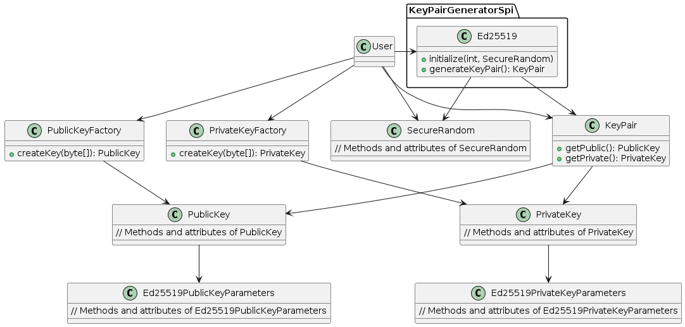
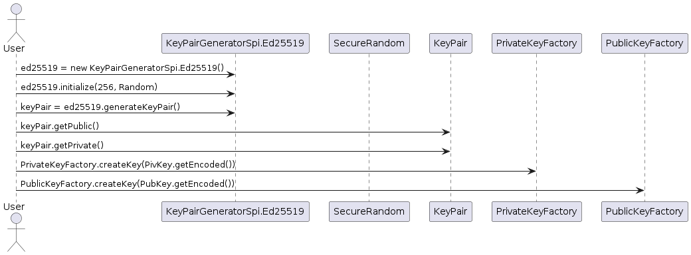

# Feature: Generate Key Pair

## 1. Specification

Given a supported key algorithm, generate a public / private key pair. 

*OPTIONAL*: 
- Generated keys *MAY* be returned as strings, encoded in a supported encoding.
- The seed used to initialize the random number generator *SHOULD* be returned.
- A seed *MAY* be specified to allow generating pseudo-random key pair (e.g. for testing purposes).

*Example:*
```json
{
    "type": "Ed25519VerificationKey2020",
    "publicKeyMultibase": "z6Mkqhx5Go6yU6yVt7vsWvu4QFPW5KMVGZmQASeiAdZ9ZmXL",
    "privateKeyMultibase": "zrv4DKJ9CLMzdmPanZmEi49nNMzj8MaHBH2CMfRQVdAr4FY1mpfex9qTGboUdmwvFA73zzzdqy6ycwXPrPELHQhdoCS"
}
```

#### 1.1 Assumptions
Multiple key algorithms *SHOULD* be supported.

#### 1.2 Constraints
Currently only verification type **Ed25519VerificationKey2020** needs to be supported.

## 2. Architecture

#### 2.1 Class Diagrams



#### 2.2 Sequence Diagrams


