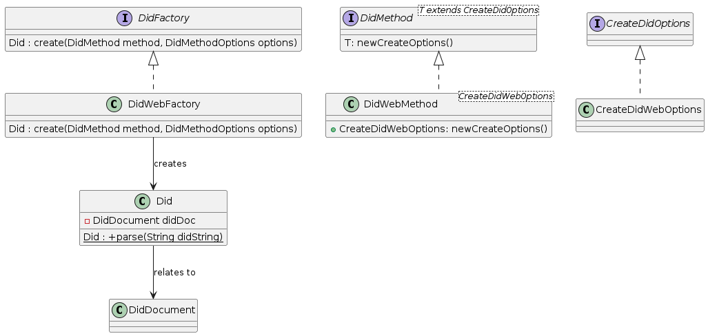

# Feature: Parse DID

## 1. Specification

Create a Decentralized Identifier (DID) as specified in [W3C-DID-Core](https://www.w3.org/TR/did-core/), for a set of supported DID methods.

*Example:*
```
did:web:mydomain.com:12345
```

#### 1.1 Assumptions
There is no need to ensure uniqueness of the created DID.

#### 1.2 Constraints
Currently only DID method **did:web** *MUST* be supported.

#### 1.3 System Environment
Any kind of registration process of a DID is out of scope and needs to be handled by the client.

## 2. Architecture

#### 2.1 Class Diagrams



#### 2.2 Sequence Diagrams
*Provide here any sequence diagrams. If possible list the use case they contribute to or solve. Provide descriptions if possible.*
