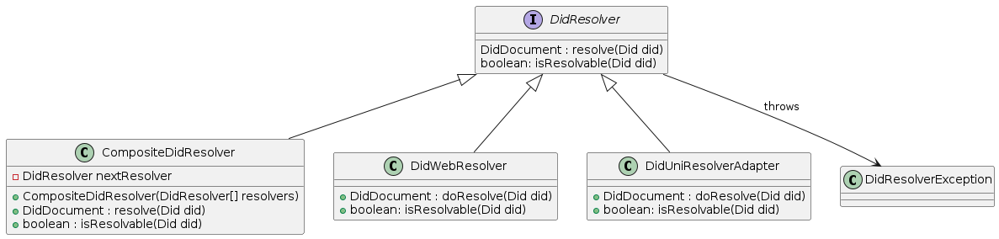

# Feature: Resolve DID Document

## 1. Specification

Given a valid DID, retrieve the respective DID document as specified in [W3C-DID-Core](https://www.w3.org/TR/did-core/), for a set of supported DID methods.

*Example:*
```json
{
  "@context": [
    "https://www.w3.org/ns/did/v1",
    "https://w3id.org/security/suites/jws-2020/v1",
    "https://w3id.org/security/suites/ed25519-2020/v1"
  ]
  "id": "did:web:mydomain.com:12345",
  "verificationMethod": [{
    "id": "did:web:mydomain.com:12345#_Qq0UL2Fq651Q0Fjd6TvnYE-faHiOpRlPVQcY_-tA4A",
    "type": "JsonWebKey2020", 
    "controller": "did:web:mydomain.com:12345",
    "publicKeyJwk": {
      "crv": "Ed25519", 
      "x": "VCpo2LMLhn6iWku8MKvSLg2ZAoC-nlOyPVQaO3FxVeQ", 
      "kty": "OKP", 
      "kid": "_Qq0UL2Fq651Q0Fjd6TvnYE-faHiOpRlPVQcY_-tA4A" 
    }
  }, {
    "id": "did:example:123456789abcdefghi#keys-1",
    "type": "Ed25519VerificationKey2020", 
    "controller": "did:example:pqrstuvwxyz0987654321",
    "publicKeyMultibase": "zH3C2AVvLMv6gmMNam3uVAjZpfkcJCwDwnZn6z3wXmqPV"
  }],
}
```

#### 1.1 Assumptions
* There *MAY* be muliple resolvers available for a given DID method.
* The priority of the resolvers *MUST* be customizable.
* A resolver *MAY* support multiple DID methods.

#### 1.2 Constraints
*none*

#### 1.3 System Environment
If the resolver is running as a separate process, all operational & communication aspects are out of scope.

## 2. Architecture

#### 2.1 Overview
Define a public resolver interface and exception class. This enables clients to freely choose the provided implementations or use a custom one.
The *isResolvable* method *SHOULD* be used to determine whether the resolver is able to resolve the DID document of a provided DID without actually doing it, which allows to apply a ressource efficient 'fail early' strategy.
Support for multiple resolvers is achieved by a resolver that applies the [Composite Pattern](https://en.wikipedia.org/wiki/Composite_pattern) to execute the provided resolvers in sequence.

#### 2.2 Class Diagrams


* DidResolver - Public interface to be used by clients.
* DidResolverException - Exception class to be thrown when a DID cannot be resolved.
* DidWebResolver / DidUniResolverAdapter - Examples of implementations of the *DidResolver* interface.
* CompositeDidResolver - *DidResolver* implementation that is able to chain multiple resolvers. It may execute the *resolve* method of each provided resolver until a  DID document is returned.
